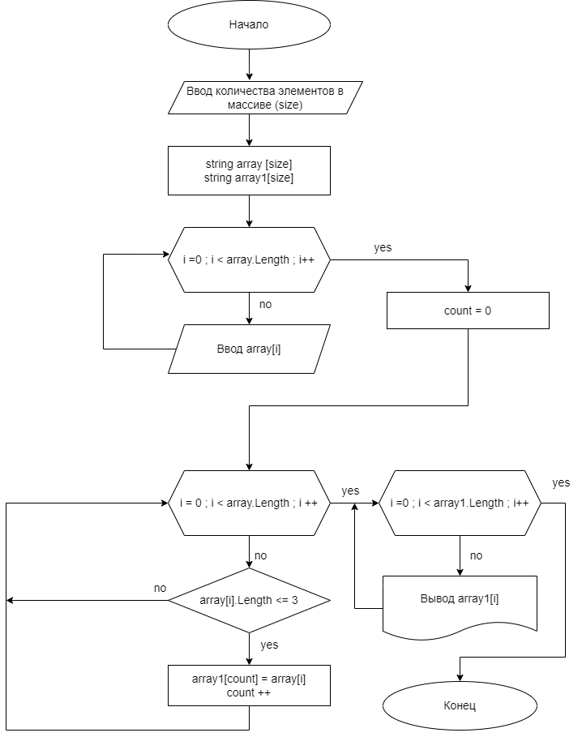

Задача : Написать программу, которая из имеющегося массива строк формирует массив из строк, длина которых меньше либо равна 3 символа. Первоначальный массив можно ввести с клавиатуры, либо задать на старте выполнения алгоритма. При решение не рекомендуется пользоваться коллекциями, лучше обойтись исключительно массивами

Описание работы программы: 
1. Пользователь вводит с клавиатуры (либо задает на старте выполнения алгоритма) размер массива строк; 
2. Программа объявляет два массива строк, размер которых равен size; 
3. Пользователь вводит по запросу с клавиатуры элементы исходного массива array; 
4. В методе CreateArrayLessOrEqualThreeCharacters программа переносит из исходного массива array в результирующий массив array1 строки,  длина которых <= 3 символа; 
5. В методе PrintArray программа выводит результирующий массив в консоль.

